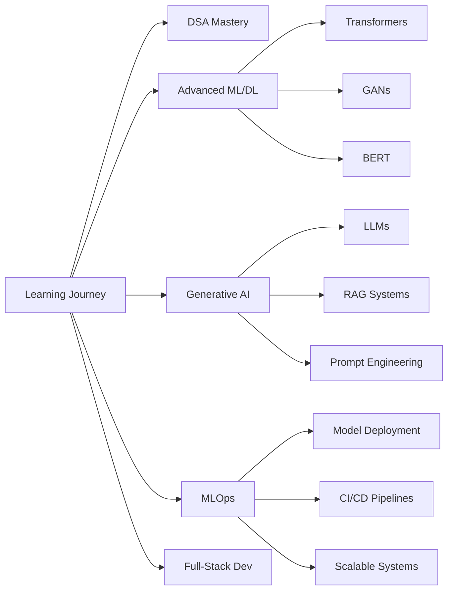

<div align="center">

# 👋 Hi, I'm Bhanu Vangapally

### 🚀 AI/ML Engineer | Data Scientist | Full-Stack Enthusiast

*Building intelligent solutions, one algorithm at a time* 🤖

[](https://linkedin.com/in/bhanu-vangapally-05b34a242)
[](https://x.com/VangapallyB)
[](mailto:vangapallybhanu18070@gmail.com)
[](https://youtube.com/@Study_matters_1)
[](https://instagram.com/mr__.bhanu_)

[](https://visitcount.itsvg.in)

</div>

---

## 💫 About Me

```python
class BhanuVangapally:
    def __init__(self):
        self.role = "AI/ML Engineer & Data Scientist"
        self.current_focus = [
            "Building AI/ML solutions for real-world problems",
            "Mastering Data Structures & Algorithms",
            "Exploring Generative AI & LLMs"
        ]
        self.learning = [
            "Advanced Machine Learning & Deep Learning",
            "RAG (Retrieval Augmented Generation)",
            "MLOps & Model Deployment",
            "Full-Stack Development (MERN Stack)"
        ]
        self.expertise = {
            "AI/ML": ["PyTorch", "TensorFlow", "Scikit-learn", "BERT", "GANs"],
            "Languages": ["Python", "Java", "C++", "JavaScript"],
            "Data": ["SQL", "Pandas", "NumPy", "Data Analysis", "EDA"],
            "Web": ["React", "HTML/CSS", "JavaScript"],
            "Tools": ["Git", "Jenkins", "Selenium", "UiPath"]
        }
        self.philosophy = "Break down complex problems into simple solutions"
    
    def say_hi(self):
        print("Thanks for dropping by! Let's build something amazing together 🚀")

me = BhanuVangapally()
me.say_hi()
```

---

## 🎯 What I Do

🔬 **AI/ML Development**
- Developing intelligent systems using Deep Learning, NLP, and Computer Vision
- Building production-ready models with PyTorch and TensorFlow
- Implementing cutting-edge architectures (BERT, GANs, Transformers)

📊 **Data Science**
- End-to-end data analysis and visualization
- Exploratory Data Analysis (EDA) and feature engineering
- Statistical modeling and hypothesis testing

💻 **Software Engineering**
- Full-stack development with React and modern JavaScript
- Building scalable applications with clean, maintainable code
- Problem-solving with Data Structures & Algorithms

🤖 **Automation & RPA**
- Process automation using UiPath and Selenium
- CI/CD pipeline development with Jenkins
- Workflow optimization and automation

---

## 🛠️ Tech Stack

### Languages


### AI/ML & Data Science


### Web Development


### Databases


### DevOps & Tools


### Automation


---

## 🚀 Featured Projects

### 🤖 [Multi-Agent Document Intelligence System](https://github.com/Bhanu-Vangapally/Multi-Agent-Document-Intelligence-System)
An enterprise-grade AI platform using **Multi-Agent Orchestration** and **RAG** to extract summaries, action items, and risks from documents.
- **Tech**: FastAPI, Streamlit, OpenAI GPT-4, FAISS, LangChain
- **Live**: [View Demo](https://ai-engine-frontend-zcyx.onrender.com)

---

## 📊 GitHub Statistics

<div align="center">


</div>

---

## 🎓 Currently Learning



---

## 🤝 Looking to Collaborate On

- 🧠 **AI/ML Projects**: Generative AI, NLP, Computer Vision applications
- 📊 **Data Science**: End-to-end analytics and visualization projects
- 🌐 **Full-Stack Development**: Data-driven web applications
- 🚀 **Open Source**: Beginner-friendly projects in AI/ML or web development

💡 **Need Help With**: MLOps, model deployment, scalable AI systems, and algorithm optimization

---

## 💬 Ask Me About

<details>
<summary><b>📚 Click to expand topics I can help with</b></summary>

- **Programming**: Python, Java, C++, JavaScript fundamentals
- **Machine Learning**: Model building, training, evaluation, hyperparameter tuning
- **Deep Learning**: Neural networks, CNNs, RNNs, Transformers, BERT, GANs
- **Data Science**: EDA, statistical analysis, data visualization, feature engineering
- **Algorithms**: DSA concepts, problem-solving techniques, coding patterns
- **SQL**: Query optimization, database design, complex joins
- **Web Development**: React basics, responsive design, API integration
- **Tools**: Git workflows, Selenium automation, UiPath RPA

</details>

---

## ⚡ Fun Facts

- 🧩 I love **breaking down complex problems** into simple, elegant solutions
- 💻 I **code every day** — learning by building is my philosophy
- 🎯 Currently solving **100+ DSA problems** to sharpen problem-solving skills
- 🌟 Passionate about making **AI accessible** through education and open-source
- 📚 Running a [YouTube channel](https://youtube.com/@Study_matters_1) to share knowledge

---

## 📫 Let's Connect!

<div align="center">

**I'm always open to interesting conversations and collaboration opportunities!**

[](https://linkedin.com/in/bhanu-vangapally-05b34a242)
[](mailto:vangapallybhanu18070@gmail.com)
[](https://x.com/VangapallyB)
[](https://youtube.com/@Study_matters_1)

[](https://discord.gg/bhanu08668)
[](https://www.facebook.com/bhanu.luckyiors)
[](https://instagram.com/mr__.bhanu_)

</div>

---

<div align="center">

### ✍️ Random Dev Quote


---

### 🎵 Currently Vibing To

**Building the future, one commit at a time** 🚀

---

*"The only way to do great work is to love what you do."* - Steve Jobs

---

**Thanks for visiting! ⭐ Star my repos if you find them interesting!**

</div>
